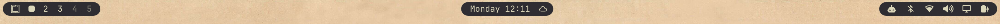

# Island Bar

An [Omarchy](https://omarchy.org) bar replacement (`kind: "bar"`): the stock
bar, with **three rounded islands** (left, center, right) on a transparent
strip. Widget layout, clicks, and panels are unchanged.



This is the Quattro equivalent of the old Waybar pattern: transparent
`window#waybar` and opaque `.modules-left` / `.modules-center` /
`.modules-right` capsules.

Plugin id: `mscurtescu.island-bar`

## Install

```bash
omarchy plugin add https://github.com/mscurtescu/omarchy-island-bar.git --enable
```

## Local copy (development)

Omarchy rejects symlinks in plugin folders, so copy (do not link):

```bash
rsync -a --delete --exclude '.git' --exclude '.gitignore' \
  /home/marius/Work/github.com/mscurtescu/omarchy-island-bar/ \
  ~/.config/omarchy/plugins/mscurtescu.island-bar/
omarchy plugin validate ~/.config/omarchy/plugins/mscurtescu.island-bar
omarchy-shell shell rescanPlugins
omarchy bar use mscurtescu.island-bar
```

Edit in the git repo, then rsync again. The shell reloads plugin files under
`~/.config/omarchy/plugins/` on save.

## Switch back

```bash
omarchy bar use fab.pillbar   # previous bar, if still installed
omarchy bar reset             # stock omarchy.bar
```

`omarchy plugin remove mscurtescu.island-bar` removes the plugin directory
(or the symlink) and restores the stock bar.

## Tracking upstream

The bar engine is copied from Omarchy's first-party plugin:

`$OMARCHY_PATH/shell/plugins/bar/`
https://github.com/basecamp/omarchy/tree/quattro/shell/plugins/bar

After `omarchy update`:

```bash
diff -u "$OMARCHY_PATH/shell/plugins/bar/Bar.qml" Bar.qml
diff -u "$OMARCHY_PATH/shell/plugins/bar/BarModel.js" BarModel.js
```

Keep the island wrapper, transparent window, and non-`required` host
properties. See `UPSTREAM.txt` for the Omarchy package this copy started from.

## License

MIT — Omarchy's bar (David Heinemeier Hansson) plus this overlay.
